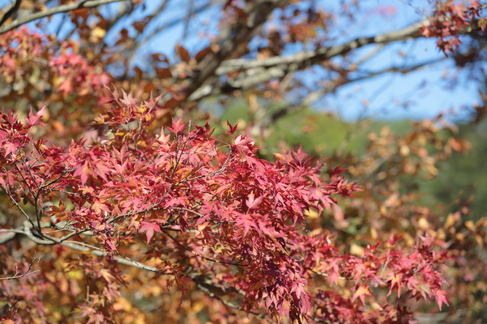
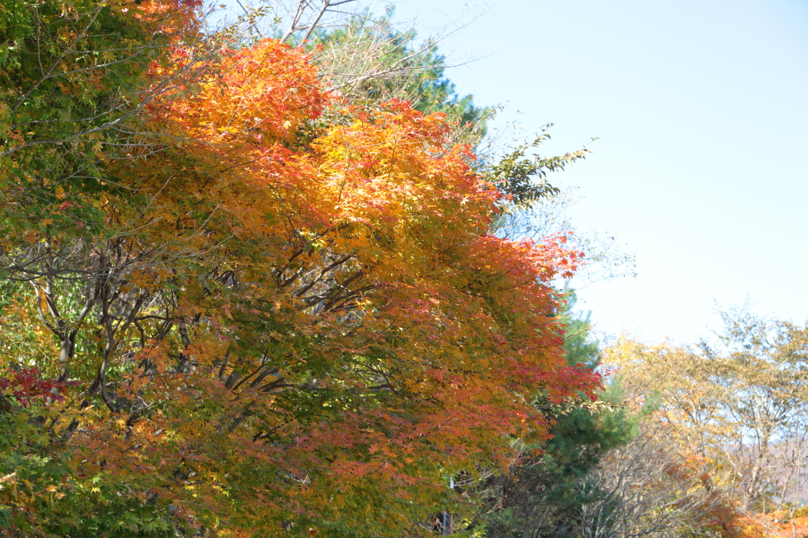
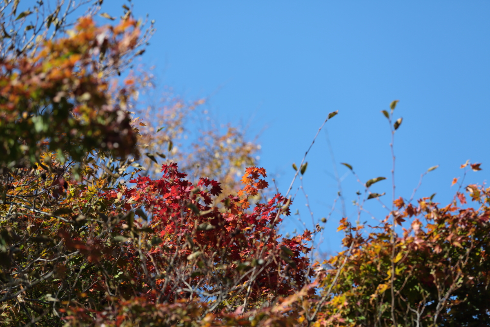
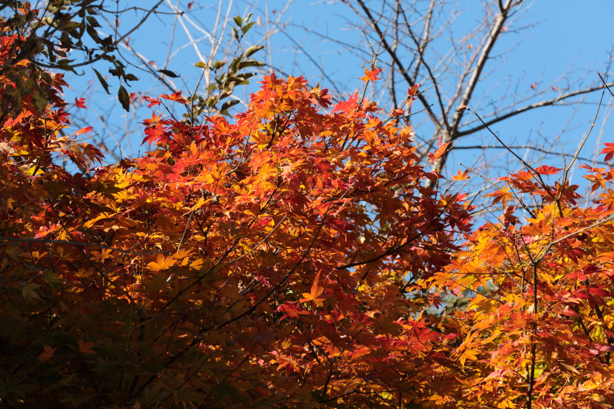

# maple
<html lang="ja">
 <head>
 <meta charset="UTF-8">
 <meta http-equiv="X-UA-Compatible" content="IE=EmulateIE10" />
 <title>miyama_ko 2020</title>

<link href="https://cdnjs.cloudflare.com/ajax/libs/lightbox2/2.7.1/css/lightbox.css" rel="stylesheet">

</head>

<body onload="alert('2020深山湖@栃木の紅葉写真です')" onunload="alert('来年もまた見せてね〜(^o^)/')">

  モバイル端末をお使いの場合は、画面を横向きにすると
  より見やすくご覧頂けます。

	
<h1><marquee behavior="left">!!! 2020年10月31日_ダム湖の紅葉@栃木、深山ダム !!!</marquee></h1>
                               

  
<h5>深山湖は宇都宮から、車で１時間強。那須エリアの南端部になります。</h5>

       
       

&#160;

&#160;

&#160;

&#160;

&#160;

&#160;

&#160;

&#160;

&#160;

       
&#160;

&#160;

&#160;

&#160;

&#160;

&#160;

&#160;

&#160;

<marquee direction="left" scrollamount="10" width="80%">2020年10月31日の紅葉＠栃木、深山湖 ~~~ (^^)/</marquee>

 

<!-- フッタ -->
 <footer>
	Copyright 2020/11/3 Sajyan
